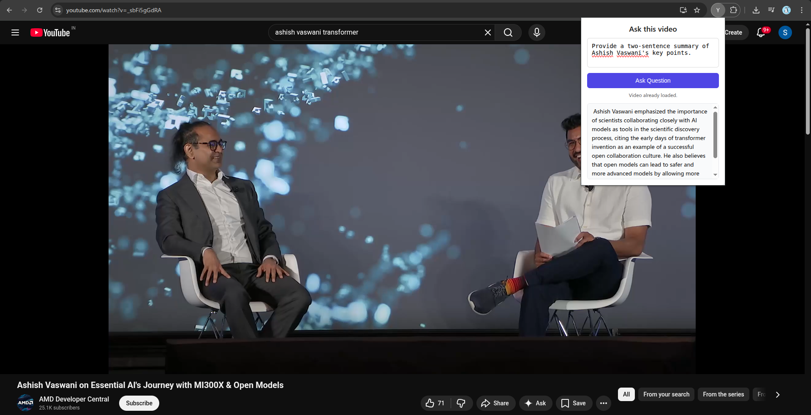
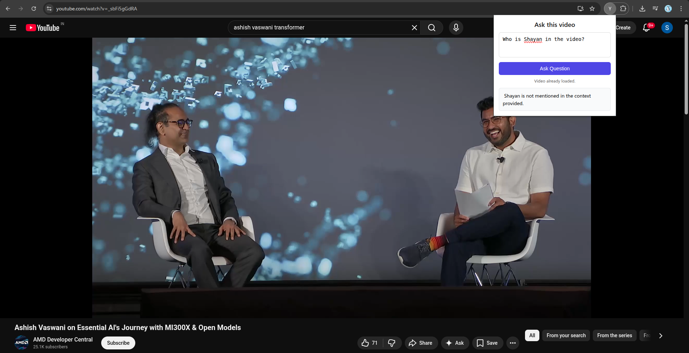

# ⃢▸ YouTube Video Chat (RAG-powered Chrome Extension)

Chat with any YouTube video using **Retrieval-Augmented Generation (RAG)**.
This project combines a **FastAPI backend**, **LangChain + ChromaDB**, and a **Chrome Extension** to let you ask questions about a YouTube video and get precise answers from its transcript.

---

##  Features

*  Automatically detects the currently opened YouTube video
*  Fetches video transcript using YouTube Transcript API
*  Builds a vector database (ChromaDB) per video
*  Uses HuggingFace LLM (Mistral 7B Instruct)
*  Simple and clean Chrome extension UI
*  Fast in-memory cache for loaded videos

---

## Project Structure

```
.
├── backend/
│   ├── main.py          # FastAPI entry point
│   ├── rag.py           # Transcript, vector store, and QA logic
│   ├── store_cache.py   # In-memory cache for vector stores
│
├── frontend/
│   ├── manifest.json    # Chrome extension manifest (MV3)
│   ├── background.js    # Detects YouTube video ID
│   ├── popup.html       # Extension UI
│   ├── popup.css        # UI styling
│   ├── popup.js         # Popup logic
│
├── diagrams/            # (Optional) UML / architecture diagrams
├── requirements.txt     # Python dependencies
└── README.md
```

---

## How It Works (High-Level Flow)

1. User opens a YouTube video
2. `background.js` extracts the `video_id`
3. Video ID is stored in Chrome local storage
4. Popup loads and sends `video_id` to backend
5. Backend:

   * Fetches transcript
   * Splits text into chunks
   * Creates embeddings
   * Stores them in ChromaDB
6. User asks a question
7. Relevant chunks are retrieved
8. LLM answers **only from retrieved context**

---

## Backend Setup (FastAPI)

### Create Virtual Environment (Recommended)

```bash
python -m venv venv
source venv/bin/activate   # Linux / Mac
# venv\Scripts\activate    # Windows
```

### Install Dependencies

```bash
pip install -r requirements.txt
```

### Set HuggingFace API Token

Create a `.env` file (recommended):

```env
HUGGINGFACEHUB_API_TOKEN=your_huggingface_api_key
```

Or set it directly in code (not recommended for production).

### Run the Backend Server

```bash
uvicorn backend.main:app --reload
```

Backend will run at:

```
http://localhost:8000
```

---

## Backend API Endpoints

### Load Video

```
GET /load_video?video_id=VIDEO_ID
```

* Fetches transcript
* Builds vector store
* Caches it in memory

**Response**

```json
{ "message": "Loaded" }
```

---

### Ask Question

```
GET /ask?video_id=VIDEO_ID&query=YOUR_QUESTION
```

**Response**

```json
{ "message": "Answer from the video transcript" }
```

---

## Chrome Extension Setup

### Open Chrome Extensions Page

```
chrome://extensions/
```

### Enable Developer Mode

Toggle **Developer mode** (top-right corner)

### Load Unpacked Extension

* Click **Load unpacked**
* Select the `frontend/` folder

### Open Any YouTube Video

* Click the extension icon
* Ask questions about the video

---

## 🖥 UI Preview

* Clean and minimal popup
* Status indicator (Loading / Ready)
* Scrollable answer box

---

## Technologies Used

### Backend

* FastAPI
* LangChain
* ChromaDB
* HuggingFace Inference API
* YouTube Transcript API

### Frontend

* Chrome Extension (Manifest V3)
* Vanilla JavaScript
* HTML + CSS

---

## Limitations

* Transcript-only (no video frames)
* In-memory cache (lost on server restart)
* Public videos with transcripts only
* HuggingFace API latency depends on load

---

##  Future Improvements

* Persistent vector store per video
* Streaming responses
* Multi-video chat
* Better error handling
* Authentication
* Local LLM support

---

## Snapshots

_Examples showing question answering, summary generation, and strict context-based responses._

<p align="center">
  
</p>

<p align="center">
  
</p>

<p align="center">
  
</p>

---

## Author

**Shayan Sarkar**
Computer Science Student
Passionate about AI

---

## License

This project is for **learning and educational purposes**.
You are free to modify and extend it.

---

⭐ If you found this project helpful, consider starring the repository!